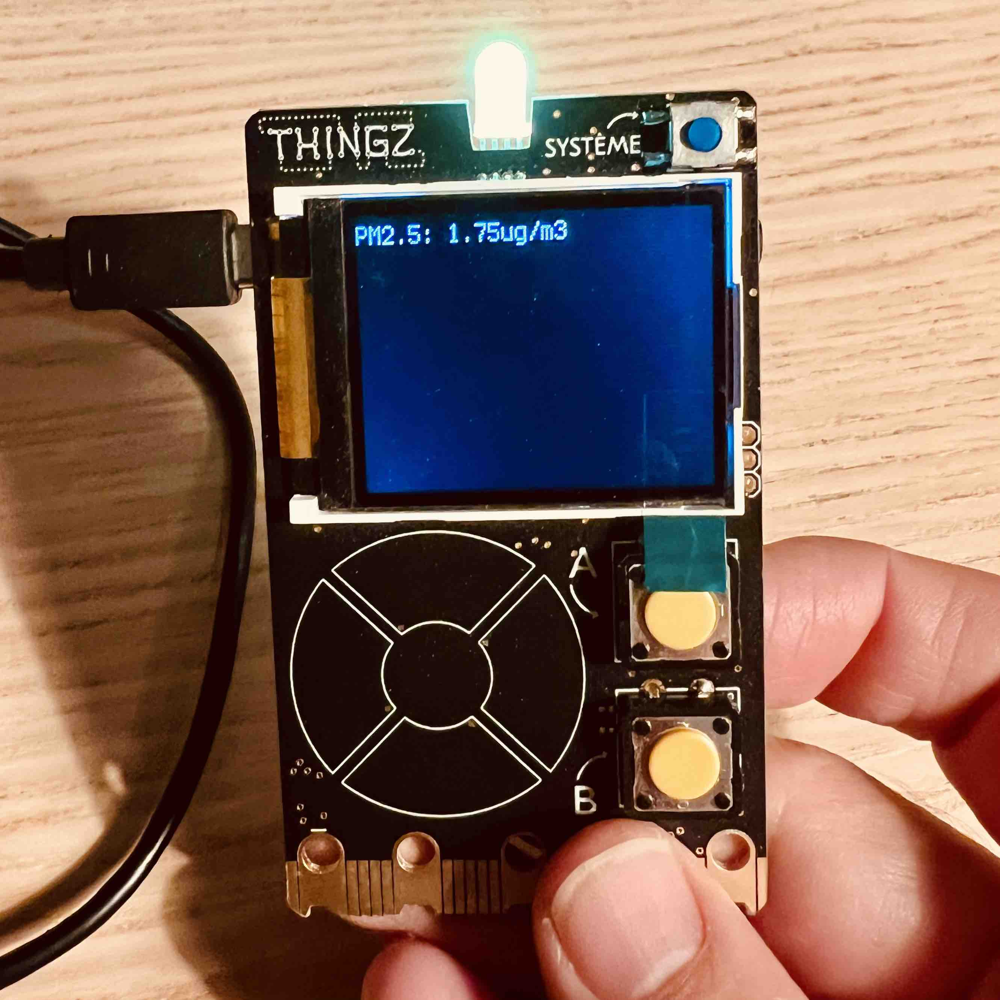

# Affichage des particules fines PM2.5 d'un capteur Sensor.Community sur la Galaxia

## Étapes à suivre
1. Flashez le dernier firmware MicroPython sur la Galaxia en utilisant le site https://play.thingz.co/firmware
2. Glissez-déposez les deux fichiers `main.py` et `urequests.py` en utilisant votre explorateur de fichiers
3. Modifiez la variable `identifiant_capteur`du programme `main.py` pour y placer le vôtre
4. Redémarrez la Galaxia
5. C'est tout bon, allez prendre un bon café pour fêter ça ☕️

